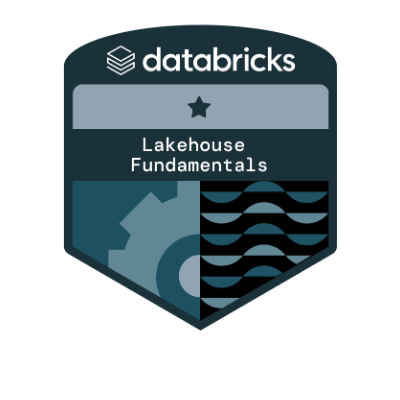

# **Marco Tulio Vilela B. Jardim** 
Hello welcome to my Data Science portfolio. In this page there's some projects that I have worked. 
Each project includes a description of the files, tools used, the problem being addressed, and notes for replication.
If you have any questions, please feel free to contact me using the information provided on the side. Additionally,if you want to see my other projects they are on the gitlab instance.

#
<strong>Professional Status</strong>

I am currently searching for a job in the field and I am open to relocating for work.

#

<strong>Tools that I use in my projects</strong>

* **Data Collect and Storage**: SQL, Postgres, MySQL, SQLite.

* **Coding**: Python, R, C, Java, Bash.

* **Statistics**: Multivariate Statistics, Descriptive Statistics, Inferential Statistics, Survival Analysis. 

* **Development**: Git, Github, Gitlab, Linux.

* **Machine Learning and Deep Learning**: Classification, Regression, Clustering, NLP.

* **Data Visualization**: Excel, Power BI, Tableau.

#
<strong>Badges</strong>

#
<strong>Links:</strong>

